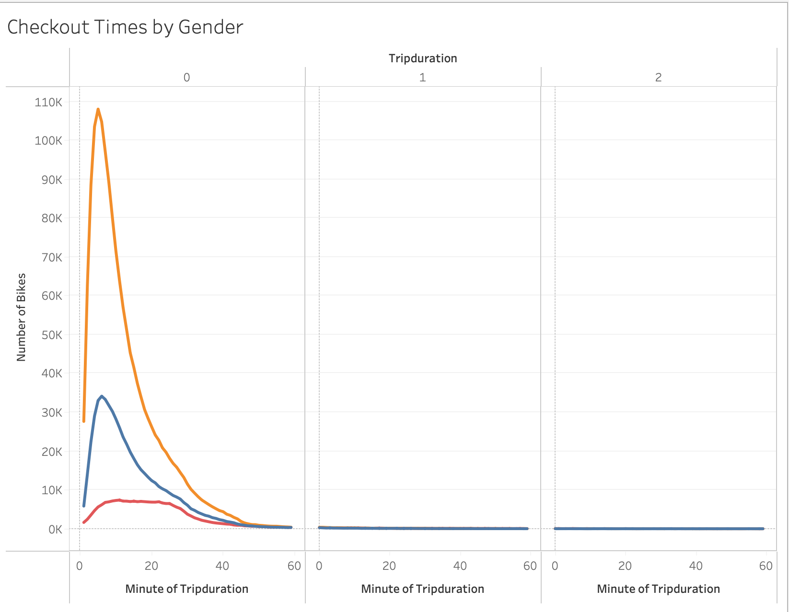
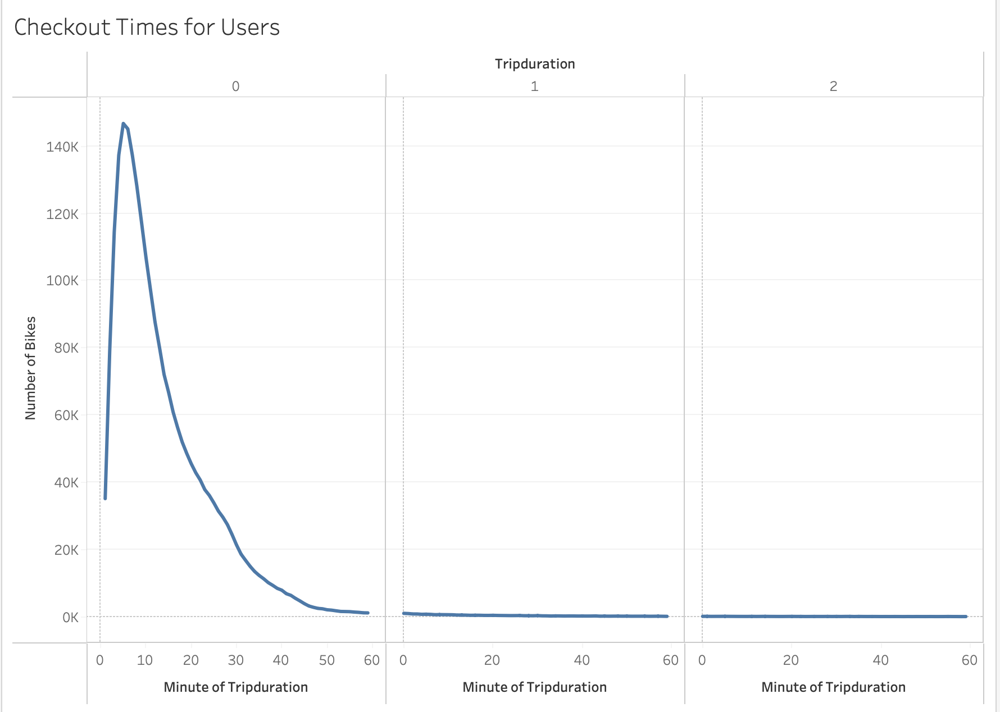
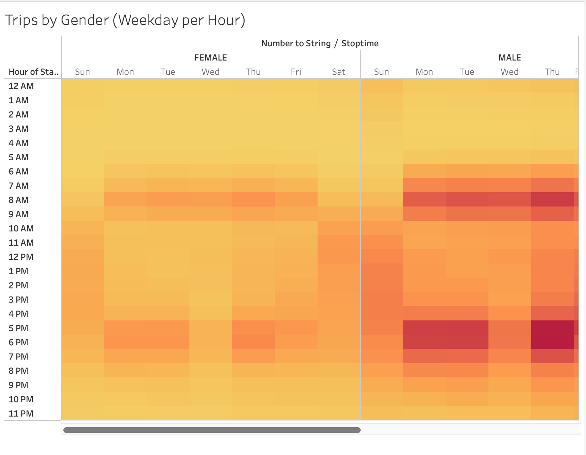
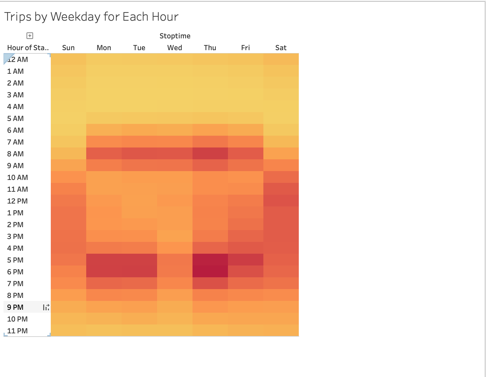
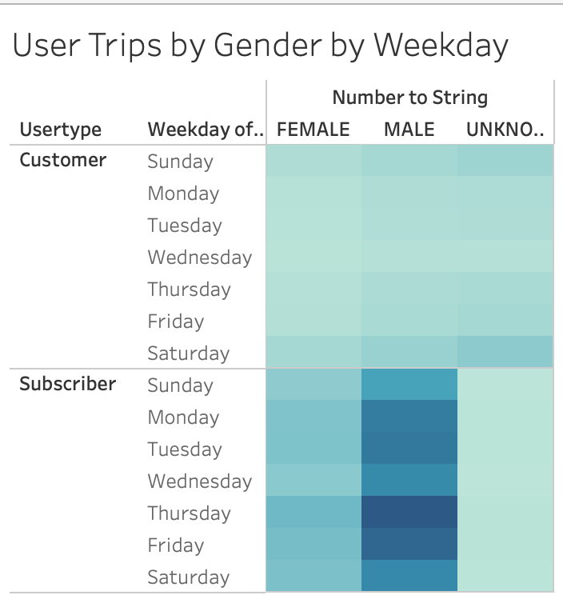

# Bikesharing
[link to dashboard](https://public.tableau.com/views/NYCCitiBikeData_16638820931710/UserTripsbyGenderbyWeekday?:language=en-US&:display_count=n&:origin=viz_share_link)
## Purpose
The purpose of this analysis is to analyze Citibike data from NYC to determine if a similar type of business could be successful in Des Moines, IA. Although the cities are extremely different in demographics, the data can still be used to answer a number of questions:
* What days/times are the service used the most/least?
* Which gender uses the bikes more?
* How long are the bikes typically used?
## Analysis
The first vizualization was created to determine the trip duration for users.

From this image, we can determine that the majority of rides are between 0-10 minutes long.

The next vizualization used the same data but further filtered by gender.

From this image, we can determine that the vast majority of users are male, and the average trip duration is the same across all genders.

The next vizualization was created to determine the times of day/days of the week when the service was utilized the most

From this image, we can determine that the bikes were used the most on weekdays before 8 AM and after 5 PM, indicating the service is used to bring people to and from work. On the weekends, the service was most utilized from the hours of 10 AM - 6PM.

The next vizualization uses the data above and further filters by gender.

From this image, we can determine that the pattern above stays true when filtering for gender.

The last vizualization utilizes customer/subscriber data to determine when the service is utilized the most, and further filters by gender.

From this image, we can determine the majority of people subscribed to the service are male, whereas the non-subscribed users have a pretty even split between male and female.
## Summary
